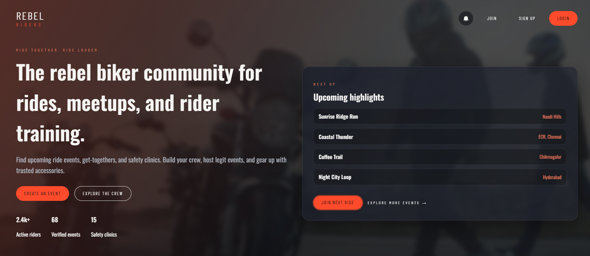

# Rebel Riders

Rebel Riders is a biker community website where riders can discover events, request to join rides, and connect with the crew.

## Live Page

[https://shubodaya.github.io/rebel-riders/](https://shubodaya.github.io/rebel-riders/)

## Homepage Screenshot

## Page Overview

- Hero section introducing the Rebel Riders community.
- Events and rides section with search and filters by type and location.
- Event cards with details such as title, place, date, distance, level, and organizer.
- Event detail modal where riders can express interest in joining.
- Community-focused authentication flow (signup, login, and Google sign-in).
- Event creation form for riders to submit new rides and meetups.
- Admin event moderation queue for approving or rejecting submitted events.
- Join-request moderation flow for admins and event owners.
- Accessories area listing rider gear with quick add-to-cart actions.
- Safety and training area covering riding best practices.
- Bikers/community area for rider identity and engagement.
- Notification panel for event and join-request status updates.
